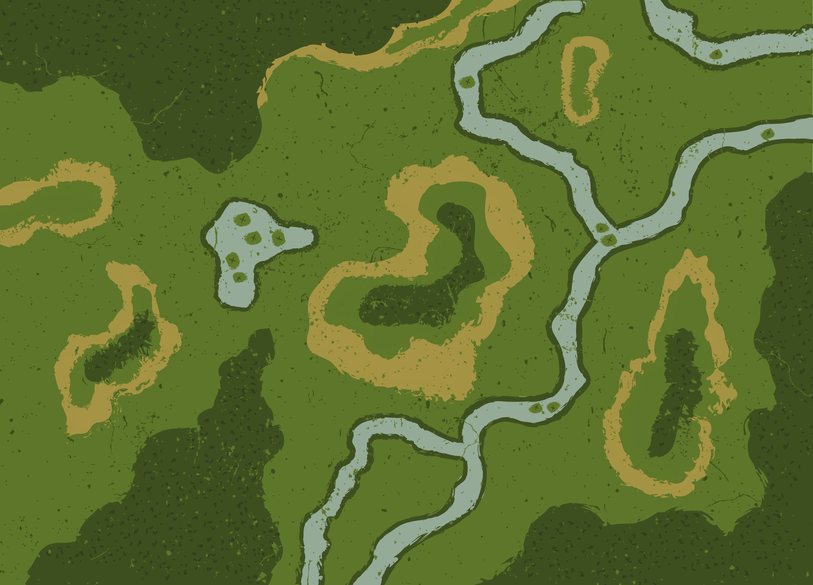

# Jogo da Onça 🐆


Implementação completa do tradicional **Jogo da Onça**, um jogo de tabuleiro estratégico brasileiro. Este projeto foi desenvolvido em Python com a biblioteca **Pygame** e conta com uma inteligência artificial baseada no algoritmo **Minimax com poda Alfa-Beta**.

---

### 🎮 Sobre o Jogo

O Jogo da Onça é um jogo de tabuleiro assimétrico para dois jogadores, onde:

* Um jogador controla **uma Onça**.
* O outro jogador controla **14 Cachorros**.

O objetivo da Onça é **capturar 5 Cachorros**, enquanto o objetivo dos Cachorros é **encurralar a Onça**, deixando-a sem movimentos válidos.

  
*Substitua a imagem acima por um screenshot real do seu jogo em ação!*

---

### ✨ Funcionalidades

* **Modos de Jogo:**
  * 👤 **Jogador vs Jogador**
  * 🤖 **Jogador vs Computador**
  * 💻 **Computador vs Computador**
* **Inteligência Artificial:**
  * Algoritmo **Minimax com poda Alfa-Beta**
  * Diferentes **funções de utilidade**
  * Profundidade da busca customizável
* **Interface Gráfica:**
  * Tela completa construída com **Pygame**, incluindo menus, tabuleiro e telas de regras

---

### 🛠️ Tecnologias Utilizadas

* **Linguagem:** Python 3.11+
* **Bibliotecas:**
  * [Pygame](https://www.pygame.org/)
  * [NumPy](https://numpy.org/)

---

### 🚀 Como Executar o Projeto

1. **Clone o repositório:**
    ```bash
    git clone https://github.com/Dudu300599/jogo_da_onca
    cd jogo-da-onca
    ```

2. **Instale as dependências:**
    ```bash
    pip install pygame
    pip install numpy
    ```

3. **Execute o jogo:**
    ```bash
    python main.py
    ```

---

### 📂 Estrutura do Projeto

```
jogo_da_onca/
│-- main.py # Ponto de entrada da aplicação
│-- README.md # Este arquivo
│-- game/ # Pacote principal do jogo
│ │-- config.py # Constantes e dados estáticos (cores, tabuleiro)
│ │-- recursos.py # Carregamento de assets (fontes, imagens)
│ │-- controlador.py # Classe principal que gerencia loop e telas
│ │-- logica/ # Módulos de regras e IA
│ │ │-- minimax.py # Algoritmo Minimax com IA
│ │ │-- utilidades.py # Funções auxiliares para avaliação de jogadas
│ │-- telas/ # Módulos das diferentes telas do jogo
│ │ │-- tela_menu.py
│ │ │-- tela_jogo.py
│ │-- utils/ # Funções utilitárias gerais
│-- imagens/ # Assets visuais (PNG, JPG)
│-- logs/ # Logs de partidas (ignorado pelo Git)
│-- EldesCordel-Demo.otf # Fonte personalizada

```


---

### 👥 Créditos

* **Desenvolvedores:** Carlos Santos & Willian Gomes  
* **Diretor de Arte:** Gabriel Ferrari  

---

